# THIS is affecting Ireland's Airbnb prices
#### An Analysis of Ireland's Airbnb Listings Data and How YOU Can Use It To Your Advantage

---

#### Author: Sorcha Nic Conmara | June 2021

In this blog post, I will discuss my findings from analysing Airbnb data on listings in Ireland. The [data from Ireland](http://insideairbnb.com/get-the-data.html) is free to access and was scraped from the Airbnb website in March 2021. The data dictionary can be accessed [here](https://docs.google.com/spreadsheets/d/1iWCNJcSutYqpULSQHlNyGInUvHg2BoUGoNRIGa6Szc4/edit#gid=982310896).

#### What is Airbnb?
> "Airbnb is an online marketplace that connects people who want to rent out their homes with people who are looking for accommodations in that locale. It currently covers more than 100,000 cities and 220 countries worldwide and has millions of hosts and travellers using it."

<figcaption>Fig.1 - Airbnb logo</figcaption> 

 

In Ireland, as of March 2021, there were over **26,000 listings** and that number is growing as more and more people realise what a **great opportunity it is to make some extra cash**. The COVID-19 pandemic also caused a surge in Airbnb bookings as overseas travel was restricted and ***'the staycation'***  became more popular.

In this blog post, I will reveal some key insights I discovered from analysing the Airbnb listings data for Ireland. You will get an insight into topics such as what the most and least expensive regions are and what contributes to listing price - i.e. what you can *avoid* as a consumer but *capitalise on* as a host!

### My first question was a simple one:
> 1. **Where in Ireland are Airbnb the most expensive?** 

To my surprise, the most expensive listings based on average listing price were in County Louth. Leitrim, for example, is the county with the  smallest population in the country, yet it had the 4th most expensive average listing price. 

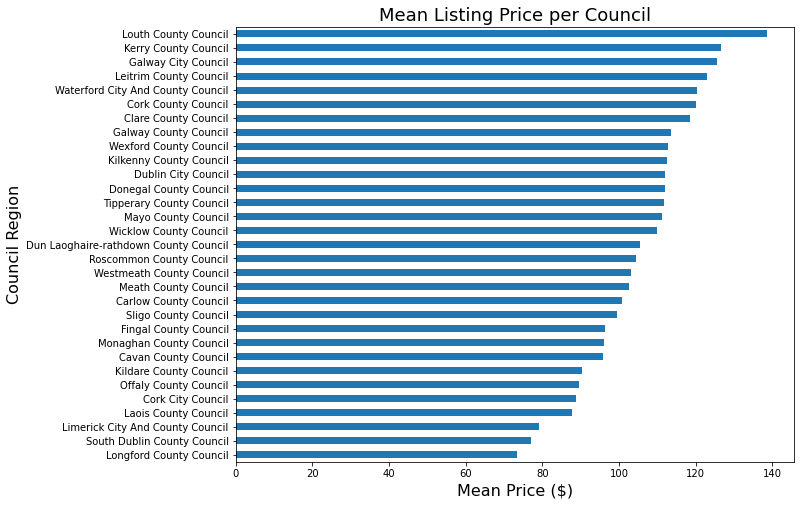

<figcaption>Fig.2 - Mean Listing Price per Council</figcaption> 

 
This seemed odd, and upon investigating the distribution of Airbnbs,we can see that they are not equally distributed across Ireland and also the price distribution is skewed. Therefore, **the average price isn't a fair representation** to group by. Any county with fewer listings (such as Louth), only needed one very expensive listing to pull its  mean listing price up, which is likely what happened.  

 
<table align="center">
<thead>
  <tr>
    <th>region_parent_name</th>
    <th>number of listings</th>
  </tr>
</thead>
<tbody>
  <tr>
    <td>Dublin   City Council</td>
    <td>5889</td>
  </tr>
  <tr>
    <td>Kerry   County Council</td>
    <td>2841</td>
  </tr>
  <tr>
    <td>Donegal   County Council</td>
    <td>1971</td>
  </tr>
  <tr>
    <td>Cork   County Council</td>
    <td>1801</td>
  </tr>
  <tr>
    <td>...</td>
    <td>...</td>
  </tr>
  <tr>
    <td>Laois   County Council</td>
    <td>163</td>
  </tr>
  <tr>
    <td>Offaly   County Council</td>
    <td>139</td>
  </tr>
  <tr>
    <td>Monaghan   County Council</td>
    <td>132</td>
  </tr>
  <tr>
    <td>Longford   County Council</td>
    <td>60</td>
  </tr>
</tbody>
</table>  

<figcaption>Fig.3 - Listings Count per Council (Snapshot) </figcaption> 

 

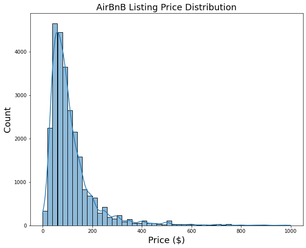 

<figcaption>Fig.4 - Airbnb Listing Price Distribution </figcaption> 

 

When comparing this with the listing price grouped by the median (the middle price, when price is ordered), we can see a slightly more realistic overview of Airbnb prices in Ireland. However, to my surprise, Louth has the 2nd most expensive median Airbnb listing price. Also, something else very surprising is that **South Dublin was the cheapest when listing prices were grouped by their median**. 

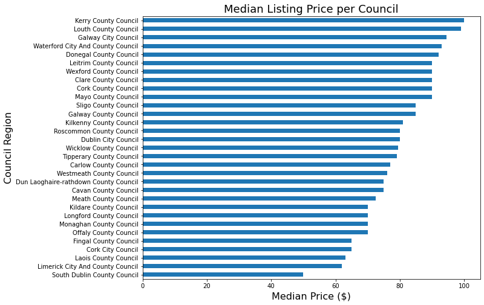  

<figcaption>Fig.5 - Median Listing Price per Council </figcaption> 

 
It seems that region definitely has a part to play in determining listing price and if you're looking to shop around, I hope you've gained some insights thus far.

### My second question was related to the growth of Airbnb:
> 2. **What counties have the fewest Airbnbs and could be areas potential hosts may consider listing a property in? Also, what kind of rooms are most popular in Ireland? (and therefore be considered by potential hosts)**

If you're considering becoming an Airbnb host, you might want to **consider hosting in Longford, Monaghan or Offaly.** These are the three regions with the fewest Airbnbs in Ireland and are therefore an investment opportunity, especially considering how popular Airbnb is becoming.

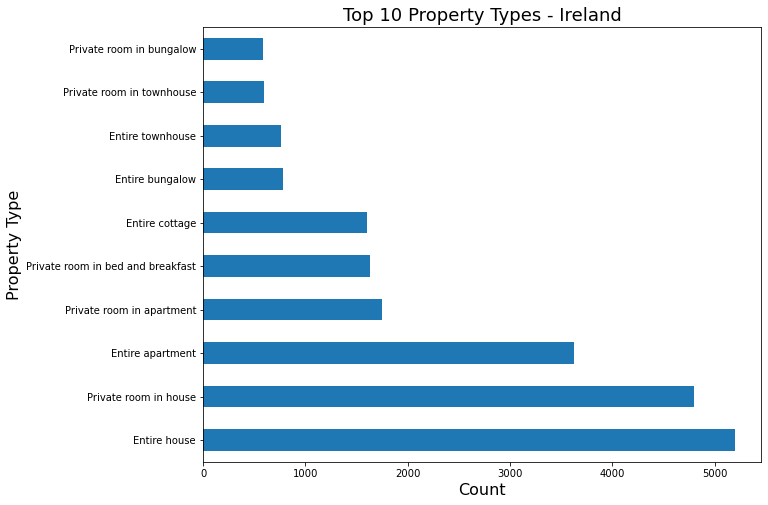

<figcaption>Fig.6 - Top 10 Property Types - Ireland </figcaption>  

 
Also, as a potential host, it is worth knowing what the most common property types are to see if what you can offer is unique and/or in demand. As you can see above, the overwhelming theme when it comes to the property types in Ireland is privacy and entirety, so keep that in mind if you're listing.

### My third question was all about the what:
> 3. **What features affect the listing price? And to what extent? i.e. what can YOU do to your Airbnb to increase its value?** 

I was surprised to learn that for Ireland, a superhost status doesn't make much of an impact on price listing. Superhosts are experienced hosts who provide a shining example for other hosts, and extraordinary experiences for their guests.

``Superhost = 0 indicates host is not a Superhost``

``Superhost = 1 indicates host is a Superhost``

 
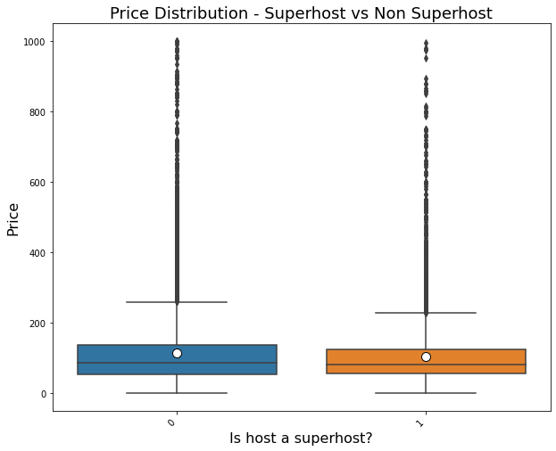

<figcaption>Fig.7 - Price Distribution (Superhost vs Non-Superhost) </figcaption> 

 
I assumed that people would likely expect to pay more to stay in a superhost's listing but this doesn't seem to be the case as both distributions are very similar. A superhost status seems to possibly have a slight impact on the `Review Scores Rating`, but only just. On a positive note, the average review score rating is rather high for hosts 
in Ireland - which is encouraging as a consumer or a potential host!  

 
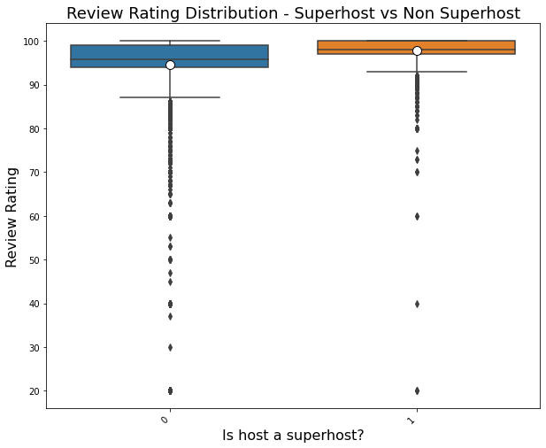

<figcaption>Fig.8 - Review Score Rating Distribution (Superhost vs Non-Superhost) </figcaption> 

 
 

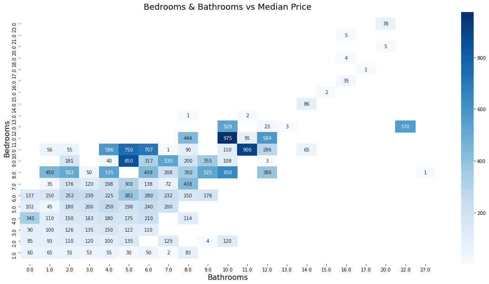

<figcaption>Fig.9 - Do Bedrooms and Bathrooms affect price? </figcaption> 

 

As expected, the number of bedrooms and bathrooms does seem to impact the price. However, as you can see from Fig. 10, it is not always a  straight-forward increase in median price. 

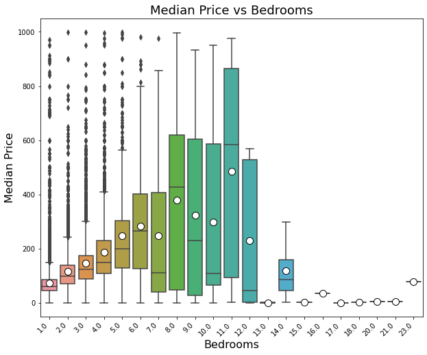

<figcaption>Fig.10 - Do Bedrooms affect median listing price? </figcaption> 

 
Interestingly, the median price for 7 bedroom listing is a lot lower than the median price for a 6 bed listing therefore it could be worth your while to filter by a range of bedrooms when browsing on Airbnb. 

 
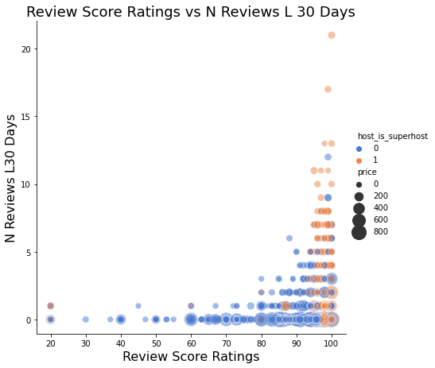

<figcaption>Fig.11 - Number of Reviews Last 3- Days/Review Score Rating vs Median Listing Price </figcaption> 

While there doesn't seem to be a strong relationship between review score rating/number of reviews in the last 30 days and the median price, we can clearly see a pattern in terms of superhosts having higher review score ratings than non-superhosts. We also see the message from Fig.8 echoed here again when looking at the distribution of review score ratings.

 
 
 
### My final question was as follows:

> 4. **Can the price of a listing be predicted? What are the most influential features in predicting price?**

I trained a basic linear regression model to investigate the most impactful features when it came to affecting the relative price of a listing. I won't bore you with the model details as that is not the purpose of this blog post. However, I will share with you my findings.  

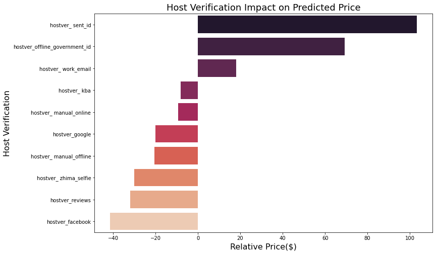

<figcaption>Fig.12 - Host Verification Impact on Predicted Price </figcaption> 

 
Host verification, especially the type of host verification used had a strong impact on relative price (both positive and negative impact as you can see). Verifying your host status using a government id or a work e-mail had a positive impact on relative price whereas verifying using facebook or manually offline had a negative impact.

We unfortunately can't yet understand this relationship completely as a description of the host verification values is not available to us.

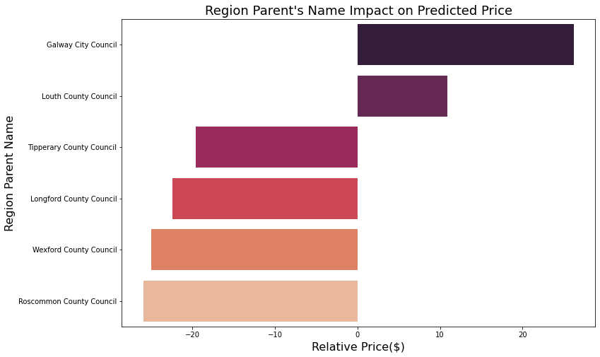 

<figcaption>Fig.13 - Region Impact on Predicted Price</figcaption> 

 
We saw from earlier analysis that price was definitely impacted by the region. We can see in Fig.13 exactly what regions have the strongest
positive and negative impacts. A listing being in Galway City and County Louth can add from 10-20+ dollars to the relative price whereas a listing in Wexford or Roscommon can take from 10-20+ dollars off the relative price.

## The Takeaway

- The pricing distribution is highly skewed, so make sure to shop around

- The top 3 most expensive regions based on median listing price are:

    1 - Kerry County Council
    
    2 - Louth County Council
    
    3 - Galway City Council

- The 3 regions which the fewest AirBnB listings are:

    1 - Longford County Council
    
    2 - Monaghan County Council
    
    3 - Offaly County Council

- It's worth filtering by a range of bedrooms/bathrooms to get the best deal

- Being a superhost does not seem to affect price while the hosts review rating seems to be higher when the host is a superhost.
  

- We've seen from the simple Linear Regression model that the region and the host's verification have the strongest impact on  predicting the relative price of a listing.
  

### How will YOU use these findings to your advantage?
